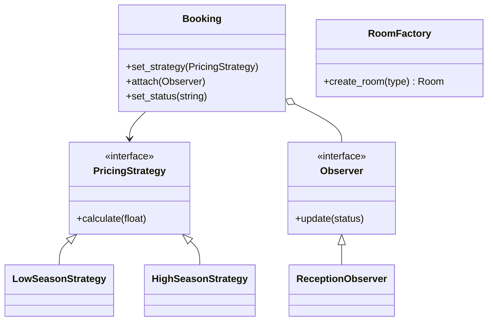

# Sistema de Gestão Hoteleira - Design Patterns

## Problema
Sistemas de hotelaria lidam com regras de negócio voláteis: preços mudam conforme a época (sazonalidade), diferentes departamentos precisam reagir a eventos de reserva (check-in, cancelamentos) e a criação de quartos pode variar conforme novas categorias surgem. O código rígido torna a manutenção cara e propensa a erros.

## Solução com Padrões de Projeto

Para resolver esses problemas, foram implementados os seguintes padrões:

### 1. Strategy (Comportamental)
* **Onde:** Cálculo de tarifas (`strategies/`).
* **Por que:** Permite alterar a regra de preço (Baixa/Alta temporada, Eventos) sem modificar a classe `Booking`.
* **Como:** A classe `Booking` recebe uma interface `PricingStrategy`. A troca pode ser feita em tempo de execução (`set_strategy`).

### 2. Observer (Comportamental)
* **Onde:** Notificações de status da reserva (`observers/`).
* **Por que:** Desacopla a reserva das ações que devem ocorrer quando ela muda (avisar financeiro, limpar quarto, etc).
* **Como:** `Booking` atua como *Subject*. Classes como `ReceptionObserver` e `FinanceObserver` se inscrevem e recebem atualizações automáticas via método `update`.

### 3. Factory Method (Criação)
* **Onde:** Criação de quartos (`factory/`).
* **Por que:** Centraliza a lógica de criação de objetos complexos (Quartos Standard vs Luxo). Facilita adicionar novos tipos de quartos sem quebrar o código cliente.
* **Como:** `RoomFactory` decide qual instância concreta de `Room` retornar baseada em uma string de entrada.

Singleton implementado em `infra/logger.py` para logs centralizados.*

## Diagrama de Classes (Simplificado)



## 🧪 Como Testar e Executar

Para que os imports funcionem corretamente, é fundamental executar todos os comandos a partir da **pasta raiz** do projeto (a pasta onde está este README).

### 1. Execução do Sistema (Cenário de Uso)
Para ver os padrões de projeto interagindo no console (Menu/CLI):

```bash
python app/main.py
```